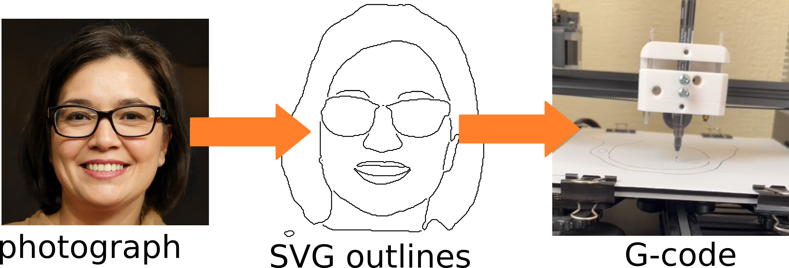

# Portrait Outliner

  

<p align="center">
  
</p>


This application takes a picture of a person, and converts the outlines of the picture into scaled Gcode for use on pen plotter or 3d printer with pen plotter attachment.

## Installation
Create and activate a virtual environment:
```bash
python3.12 -m venv .venv
source .venv/bin/activate
```
Clone repository
```bash
git clone https://github.com/horatioh13/Portrait-Draw.git
```
Install requirements
```bash
pip install -r requirements.txt
```

## Usage
Run default script by pulling image from thispersondoesnotexist.com 
```bash
python3 run_everything.py
```
If you get a libGL.so.1 error, try:
```bash
sudo apt update && sudo apt install libgl1
```
## Features

This project provides a variety of command line arguments to customize the behavior of the drawing robot script. Below is a list of available arguments and their purpose:

| Argument           | Type    | Default                        | Description                                 |
|--------------------|---------|--------------------------------|---------------------------------------------|
| `--image_source`   | `str`   | `thispersondoesnotexist`     | Specifies the source of the image to be used. Other options include: `laptopwebcam`, `usbwebcam`, or `file`. |
| `--plot_bitmaps`   | `bool`  | `False`                        | Boolean flag to indicate whether to display bitmaps in OpenCV window before generating SVGs. |
| `--pendownzheight` | `float` | `14.5`                         | Sets the Z height when the pen is down.     |
| `--offset`         | `float` | `4`                            | Specifies the zhop value.                   |
| `--scalingfactor`  | `float` | `0.586`                        | Determines the scaling factor for the image. Default size is 256x256mm. |
| `--nudgexy`        | `float` | `42.5`                         | Sets the nudge XY value. Nudge XY units are in mm. Best combined with a scaling factor to position image in center of drawing bed. |
| `--gcode_file`     | `str`   | `None`                         | Specifies the G-code file to be sent over serial. Only works when PyGcodeSender.py is in the file. |
| `--speed`     | `float`   | `3000`                         | Specifies the speed that the robot moves at in mm/min |


These arguments allow for fine-tuning various parameters to better suit your specific needs when running the drawing robot script.

Example usage:
```bash
python3 run_everything.py --image_source laptopwebcam --pendownzheight 10.2 --offset 2.5 --gcode_file output.gocde
```


## Hardware
I used [Pltr Toolhead V2](https://github.com/AndrewSink/pltr_toolhead) for the pen plotter, and [PyGcodeSender](https://github.com/ShyBoy233/PyGcodeSender) to send gcode to my printer over a serial connection. 

https://github.com/user-attachments/assets/70344170-36a1-4fbf-b9ee-893f828de9ab

## Example Photographs
<p align="center">
  
  
  
</p>


## References

This package uses the code from the following repositories:
* [Face Crop Plus](https://github.com/mantasu/face-crop-plus) - Image preprocessing package for automatic face alignment and cropping with additional features.
* [rembg](https://github.com/danielgatis/rembg) - Rembg is a tool to remove images background.


